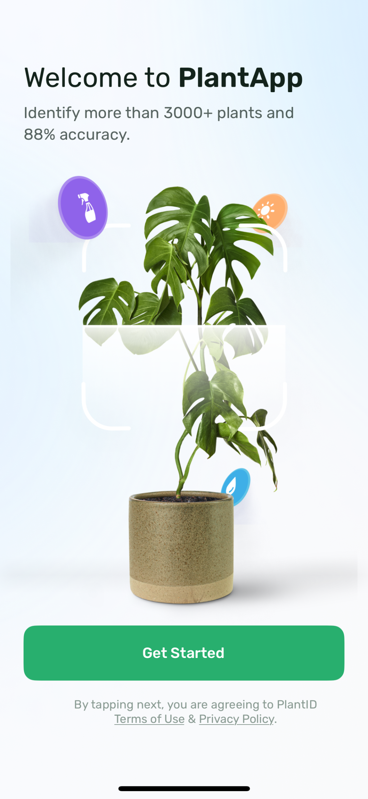

[](https://github.com/guvenkaranfil/PlantApp/actions/workflows/pr.yaml)

# PlantApp - Case Study

PlantApp is a case study project created to demonstrate my mobile development skills, with a focus on:

- Designing a scalable project architecture
- Implementing pixel-perfect design screens
- Practicing Test-Driven Development (TDD) and contributing to existing codebases
- Applying powerful refactoring supported by comprehensive tests

# Getting Started

> **Note**: Make sure you have completed the [React Native - Environment Setup](https://reactnative.dev/docs/environment-setup) instructions till "Creating a new application" step, before proceeding.

## Environment Setup Requirements

Please ensure that you have installed the specified versions for a smoother case review experience.

### Dependencies

| Dependency     | Version       |
| -------------- | ------------- |
| Ruby           | 2.7.5         |
| Xcode          | 16            |
| CocoaPods      | 1.11.3        |
| Java (OpenJDK) | 17.0.12 (LTS) |
|  Android SDK   |  API 35       |
| Node           | 21.5.0        |

### Step 1

---

Clone repository

```bash
git clone https://github.com/guvenkaranfil/PlantApp.git
```

### Step 2

---

Run the following command to install the necessary dependencies:

```bash
yarn install
```

For iOS projects, navigate to the ios directory and install CocoaPods:

```bash
cd ios && pod install
```

First, you will need to start **Metro**, the JavaScript _bundler_ that ships _with_ React Native.

To start Metro, run the following command from the _root_ of your React Native project:

```bash
yarn start
```

### Step 3: Start your Application

Let Metro Bundler run in its _own_ terminal. Open a _new_ terminal from the _root_ of your React Native project. Run the following command to start your _Android_ or _iOS_ app:

#### For Android

```bash
yarn android
```

#### For iOS

```bash
yarn ios
```

If everything is set up _correctly_, you should see your new app running in your _Android Emulator_ or _iOS Simulator_ shortly provided you have set up your emulator/simulator correctly.

This is one way to run your app — you can also run it directly from within Android Studio and Xcode respectively.

## Congratulations! :tada:

You've successfully run the project! 🎉 After launching the application, the Get Started screen should pop up.



# Tests

This project includes both unit and end-to-end (E2E) tests to ensure the quality and functionality of the application.

- **Total Unit Tests**: 20
- **Total E2E Tests**: 1

### Unit Tests

Unit tests are implemented to verify the individual components and functions of the application. To run the unit tests, use the following command:

```bash
yarn run test
```

### E2E Tests with Detox

> **Note**: Make sure you have completed the [Detox - Environment Setup](https://wix.github.io/Detox/docs/introduction/environment-setup) before proceeding.

> The `onboarding.e2e.test` ensures that users can successfully complete the onboarding process and navigate to the home page.

#### Run e2e tests for iOS

---

First run below command to build project for preparing running e2e tests with detox:

```bash
yarn run e2e:build-release:ios
```

After successfull build, run below command to start e2e tests:

```bash
yarn run e2e:test-release:ios
```

#### Run e2e tests for Android

---

Currently, android is not configured properly to run e2e tests.

### Custom UI Compare Tests

---

Identifying UI bugs through manual inspection is nearly impossible. Even with a thorough review of every UI component, the process is time-consuming. To streamline this, the project includes a custom Bash script called compare_images.sh, which compares images in the `baseline` directory with those in the `current` directory. If there is changes between the image files, it creates a file-name-diff.png to visualize differences with coloring red. This script utilizes [imagepick](https://imagemagick.org) for the comparison process.

Before running the script make sure imagepick installed:

```bash
brew install imagemagick
```

Run below command to get screenshots and compare them against images under `baseline`:

```bash
yarn run compare:ui
```

If there are some changes but they are intend to be, just run below command to update baseline:

```bash
yarn run update:baseline
```


## Dependencies

| Dependency          | Purpose                                                                                             |
| ------------------- | --------------------------------------------------------------------------------------------------- |
| `react-native-mmkv` | A high-performance storage library for React Native, used for persisting data efficiently.          |
| `react-navigation`  | Provides routing and navigation solutions for the app, enabling smooth transitions between screens. |
| `reduxjs/toolkit`   | A powerful toolset for managing global application state with Redux, simplifying state management.  |

## Development Dependencies

| Dev Dependency                          | Purpose                                                                                                              |
| --------------------------------------- | -------------------------------------------------------------------------------------------------------------------- |
| `svgr/cli`                              | Converts SVG files into React components for easy usage within the application.                                      |
| `testing-library/react-native`          | A testing library for React Native, allowing for user-centric tests of the UI components.                            |
| `jest`                                  | A JavaScript testing framework used for running tests in the project, ensuring code reliability.                     |
| `eslint-*`                              | Linting tools that help maintain code quality and consistency by enforcing coding standards.                         |
| `husky`                                 | A tool for managing Git hooks, ensuring that quality checks (like linting and testing) are performed before commits. |
| `prettier`                              | A code formatter that helps maintain a consistent code style across the project.                                     |
| `react-native-image-resource-generator` | A tool for generating given images to a static class to access easily across codebase.                               |


# Demo


